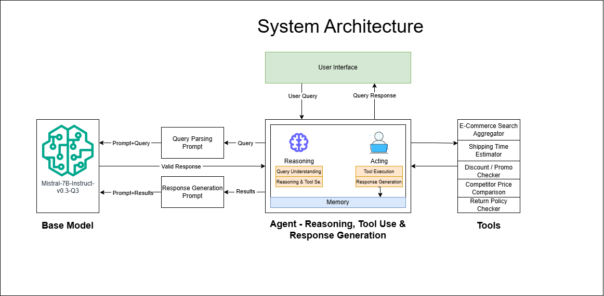

# **Virtual Shopping Assistant**

## **1. Overview**  
The **Virtual Shopping Assistant** is an AI-powered agent designed to help online shoppers navigate multiple fashion e-commerce platforms. The assistant interprets user queries, selects appropriate tools, executes actions, and generates human-readable responses. The project follows an **agentic reasoning framework** inspired by **ReAct, Toolformer, LATS, and CoT** methodologies.

---

## **2. Comparative Conceptual Map**  

### **Approaches Considered**  

| Approach  | Reasoning Style | Tool Selection | Execution Strategy | Strengths | Weaknesses |
|-----------|----------------|----------------|---------------------|-----------|------------|
| **ReAct** | Interleaves reasoning and acting | Uses thought-action loops | Executes tools sequentially | Enables real-time adjustments | Can be inefficient for multi-tool queries |
| **Toolformer** | Self-supervised tool use | Predicts tool calls inside responses | Executes via external API calls | Handles dynamic tool use | Tool integration can be complex |
| **LATS** | Multi-turn memory-aware reasoning | Uses learning-based tool selection | Prioritizes tool execution order | Improves contextual coherence | High computation cost |
| **CoT** | Step-by-step reasoning before action | Decides tool use post-analysis | Runs tools based on structured outputs | Reduces hallucinations | Can over-structure responses |

### **Selected Approach: Hybrid (ReAct + Toolformer + CoT)**  
- **ReAct-style reasoning** ensures dynamic decision-making.
- **Toolformer-style tool selection** for flexible API integration.
- **CoT-inspired structured response generation** to enhance clarity.

---

## **3. Analysis (Performance of Methods)**  

The system operates in the following steps:

### **1. User Query Parsing**
The user inputs a query, which is structured using a predefined prompt (`./prompts/system_prompt.txt`) with the help of a base model (Mistral 7B) communicated using HTTPS.

**Example Input:**  
```
"Find a floral skirt under $40 in size S. Is it in stock, and can I apply a discount code ‘SAVE10’?"
```

**Example Output:**  
```json
[
    {"type": "find", "item": "floral skirt", "attributes": ["S"], "budget": "$40", "discount_code": "SAVE10", "delivery": ""},
    {"type": "stock", "item": "floral skirt", "attributes": ["S"], "budget": "$40", "discount_code": "SAVE10", "delivery": ""}
]
```
**Result and performance:** 
The system correctly parses user queries into JSON objects, generating multiple objects for multiple queries within a single input. However, it heavily depends on the base model and its deployed version. While operations on the agent side are relatively fast, execution time and performance on the base model side depend on the hosted model and the method used for interaction (e.g., API-based access).

### **2. Reasoning & Tool Selection**
The parsed user query determines which tools to use based on the extracted attributes. 

**Example Section:**  
```python
if query_type == "find":
    response["thoughts"].append(f"Searching for {item} with attributes {attributes} under ${budget}.")
    results["search"] = search_products(query=item, max_price=int(budget) if budget else None)
```
**Result and performance:** 
The reasoning and tool selection process follows a Python-based linear operation, where the output from the query parser determines which tool to use and with what parameters. The tool selection performs well for the coded conditions and can be extended to integrate additional tools as needed.


### **3. Tool Execution**
The selected tools fetch relevant data.

**Example Execution:**  
```python
def search_products(query, color=None, size=None, max_price=None):
    """Simulate searching products on multiple e-commerce platforms."""
    products = [
        {"name": "Floral Skirt", "price": 35, "color": "red", "size": "S", "stock": True},
        ...
    ]
    # Filter based on user criteria
    results = [
        p for p in products if
        (not color or p["color"].lower() == color.lower()) and
        ...
    ]
    return results
```

**Result and performance:** 
Every tool execution is driven by the agent, where each tool accepts parameters and processes the result. Currently, the tools generate dummy data, which can be improved by integrating more external and reliable tools such as a calendar, web search, etc.

### **4. Response Generation**
The results are converted into a human-readable response.

**Example Output:**  
```
"I found a Floral Skirt in size S for $35 that is in stock. You can apply the discount code 'SAVE10' for a 10% discount."
```

**Result and performance:** 
"Response generation is performed using a hosted base model, where results are passed in a JSON object along with the user's query. The model then translates the results into a human-readable format and returns them via API. This process heavily depends on the base model's performance and can be improved by using more reliable and domain-specific models.

---

### **process_query(user_query)**
The `process_query` method analyzes a user query, determines the required tools to invoke based on an LLM-generated JSON structure, and returns a structured response. It follows a reasoning and acting framework to dynamically select and execute appropriate tools.

- Uses `parse_query_with_base_model(user_query)` to convert user input into a structured format.
- Iterates over parsed query parts and identifies the required tool based on `query_type`.
- **Tool Execution:**
  - **"find"** → Calls `search_products()` to find items within the budget.
  - **"discount"** → Calls `apply_discount()` to check promo code validity.
  - **"shipping"** → Calls `estimate_shipping()` for delivery estimation.
  - **"prices"** → Calls `compare_prices()` to compare item prices.
  - **"return_policy"** → Calls `get_return_policy()` to check return policies.
- Logs tool executions in `response["thoughts"]`.
- Calls `generate_human_response(results, user_query)` to create a user-friendly output.

---

### **parse_query_with_base_model(user_query)**
The `parse_query_with_base_model` method converts a user query into a structured JSON format using LM Studio's hosted API. It ensures accurate query parsing for downstream processing.

- Reads the predefined prompt template from `self.prompt_file`.
- Replaces `{user_query}` placeholder with the actual user query.
- Prepares an API request with:
  - `model_name`
  - `Message` with user query
  - `Parameters`: (`temperature = 0.2`, `max_tokens = 2084`, `stream = False`)
- Sends a `POST` API request with the payload and uses `response.raise_for_status()` to detect HTTP errors.
- Extracts structured JSON from `parsed_response["choices"][0]["message"]["content"]`.
- Parses JSON content into Python objects.

---

### **generate_human_response(structured_results, user_query)**
The `generate_human_response` method converts structured tool results into a human-readable response using LM Studio.

- Reads the response prompt template from `self.response_prompt_file`.
- Injects the user query into the prompt for context.
- Formats structured tool results into a JSON string and embeds them into the prompt.
- Sends a request to LM Studio with the formatted prompt, using parameters:
  - `temperature = 0.5` for balanced creativity.
  - `max_tokens = 300` to ensure a complete response.
  - `stream = False` to return a single response.
- Processes the API response, extracts the generated text, and returns it.

---

### **search_products(query, color=None, size=None, max_price=None)**
The `search_products` method searches for products across multiple e-commerce platforms based on user-defined criteria such as name, color, size, and price range.

- Takes user input: `query`, `color`, `size`, `max_price`.
- Filters through predefined product listings to find matches.
- Returns a list of products that meet the specified criteria.

**Example Output:**  
```json
[
    {"name": "Floral Skirt", "price": 35, "color": "red", "size": "S", "stock": true}
]
```

---

### **estimate_shipping(location, delivery_deadline)**
The `estimate_shipping` method estimates the shipping cost and delivery time based on the user's location and required delivery deadline.

- Checks available shipping options (standard, express, overnight).
- Determines the fastest available option that meets the deadline.
- Returns shipping method, cost, and delivery days if feasible.

**Example Output:**  
```json
{
    "method": "express",
    "cost": 15,
    "days": 2
}
```

---

### **apply_discount(base_price, promo_code)**
The `apply_discount` method validates and applies a discount code to calculate the final price of a product.

- Checks if the provided promo code is valid.
- Applies the corresponding discount percentage to the base price.
- Returns the original price, discount applied, and final price.

**Example Output:**  
```json
{
    "original_price": 100,
    "discount_applied": 0.1,
    "final_price": 90
}
```

---

### **compare_prices(product_name)**
The `compare_prices` method retrieves competitor pricing for a given product across multiple online stores.

- Checks price listings for major e-commerce sites (e.g., SiteA, SiteB, SiteC).
- Returns a dictionary of store names with corresponding prices.

**Example Output:**  
```json
{
    "SiteA": 80,
    "SiteB": 75,
    "SiteC": 85,
    "SiteD": 78
}
```

---

### **get_return_policy(store_name)**
The `get_return_policy` method retrieves the return policy for a given e-commerce store.

- Checks a predefined list of return policies for different stores.
- Returns the corresponding policy description.

**Example Output:**  
```
"Returns accepted within 14 days. Buyer pays return shipping."
```

## **4. Architecture Overview** 
# System Architecture

The system follows a structured agent-based approach where reasoning, tool execution, and response generation are modularized. It is designed to handle complex user queries related to e-commerce shopping, leveraging external tools for better decision-making.



## **Key Components:**

### **1. User Interface**
- Accepts user queries and displays responses.

### **2. Agent (Reasoning, Tool Use & Response Generation)**
- **Reasoning Module**
  - Understands user queries.
  - Determines the appropriate tools needed for execution.
- **Acting Module**
  - Executes tool calls based on reasoning outputs.
  - Formats and generates the final response.
- **Memory**
  - Stores past interactions to improve multi-turn reasoning and user experience. **(Currently removed)**

### **3. Base Model (Mistral-7B-Instruct-v0.3-Q3)**
- **Query Parsing Prompt**
  - Converts user queries into structured tasks for the agent.
- **Response Generation Prompt**
  - Converts tool results into structured and coherent responses.

### **4. Tools**
- **E-Commerce Search Aggregator** – Finds products matching user criteria.
- **Shipping Time Estimator** – Predicts estimated delivery time.
- **Discount / Promo Checker** – Checks for available discounts and promotions.
- **Competitor Price Comparison** – Retrieves price comparisons from multiple platforms.
- **Return Policy Checker** – Provides return policy details for selected products.

## **Workflow:**
1. The **user submits a query** via the interface.
2. The **query parsing prompt** processes the input to generate structured requests.
3. The **reasoning module** determines the necessary tools.
4. The **acting module** executes tool calls and retrieves results.
5. The **response generation prompt** formats the output.
6. The **final response is sent back to the user**.

This architecture ensures that the system can handle **complex multi-turn queries**, integrate **real-time external data**, and generate **structured, informative responses** for online shoppers.

---

## **6. Results**  

### **Task A: Basic Item Search + Price Constraint**  
- **User Query:**  
  *"Find a floral skirt under $40 in size S. Is it in stock, and can I apply a discount code ‘SAVE10’?"*  
- **Agent Steps:**  
  Invoke the search aggregator and discount checker tools as needed.  
- **Agent Response:**  
  *"I found a Floral Skirt in size S for $35 that is in stock. You can apply the discount code 'SAVE10' for a 10% discount."*  

---

### **Task B: Shipping Deadline**  
- **User Query:**  
  *"I need white sneakers (size 8) for under $70 that can arrive by Friday."*  
- **Agent Steps:**  
  Use the search aggregator and shipping time estimator tools.  
- **Agent Response:**  
  *"I'm sorry for any inconvenience, but I couldn't find white sneakers (size 8) under $70 that are available and can be delivered by Friday. However, I found a pair of white sneakers for $65, but they won't arrive by Friday due to shipping restrictions. If you're interested, I can provide more details or help you find other items within your budget."*  

---

### **Task C: Competitor Price Comparison**  
- **User Query:**  
  *"I found a ‘casual denim jacket’ at $80 on SiteA. Any better deals?"*  
- **Agent Steps:**  
  Utilize the competitor price comparison tool.  
- **Agent Response:**  
  *"I'm sorry, but I couldn't find a better deal for a casual denim jacket. Here are some other items available:"*  

  1. **Floral Skirt** - $35 - Red, Size S (In Stock)  
  2. **Casual Denim Jacket** - $80 - Blue, Size M (In Stock)  
  3. **White Sneakers** - $65 - White, Size 8 (Out of Stock)  
  4. **Leather Jacket** - $140 - Black, Size L (In Stock)  
  5. **Running Shoes** - $120 - Gray, Size 10 (In Stock)  
  6. **Graphic T-Shirt** - $25 - Yellow, Size M (Out of Stock)  
  7. **Formal Trousers** - $50 - Navy, Size 32 (In Stock)  
  8. **Sunglasses** - $90 - Black, One Size (In Stock)  
  9. **Backpack** - $60 - Green, Medium (Out of Stock)  
  10. **Winter Coat** - $110 - Gray, XL (In Stock)  

---

### **Task D: Returns & Policies**  
- **User Query:**  
  *"I want to buy a cocktail dress from SiteB, but only if returns are hassle-free. Do they accept returns?"*  
- **Agent Steps:**  
  Employ the return policy checker tool.  
- **Agent Response:**  
  *"I'm sorry, I couldn't find any cocktail dresses on SiteB. However, they do accept returns within 14 days, but the buyer pays for return shipping."*  

---

### **Task E: Combine Multiple Tool Usages**  
- **User Query:**  
  *"Find me a black leather jacket in size L under $150. Check if there are any discounts available. Compare its price across different stores. If I order today, can it arrive within 3 days? Also, what’s the return policy for SiteB?"*  
- **Agent Steps:**  
  Combine multiple tool usages including search, discount checking, price comparison, shipping estimation, and return policy verification.  
- **Agent Response:**  
  *"I'm sorry for any inconvenience, but I couldn't find the black leather jacket in question at other stores. However, I did find one on SiteB that matches your criteria: a black leather jacket priced at $140 (with no discount applied). If you order today using express shipping, it should arrive within 2 days, but keep in mind there's an additional shipping cost of $15. The return policy for SiteB is that returns are accepted within 14 days, with the buyer responsible for return shipping costs."*  


## **7. Challenges & Improvements**  

### **Real Challenges Faced**  
1. **Converting User Queries to Actions & Human-Readable Responses:**  
   - Users submit free-form text, which the system must convert into structured JSON objects.  
   - Basic implementations like regex were insufficient for complex query parsing.  
   - **Solution:** Utilized a base model LLM with well-defined prompts for both query parsing and response generation.  
   - **Limitation:** The effectiveness depends on the base model used and its implementation.  

2. **Memory Management:**  
   - Maintaining context without overloading the system was challenging.  
   - Context retention can improve response time and user experience.  
   - **Current Status:** No suitable approach for efficient data organization and retrieval was found, so this remains on hold.  

---

## **8. Open Questions & References**  

### **Open Questions**  
1. How I can manage more tools integrations with smooth processing?
2. If we integrate real-time inventory tracking from live e-commerce APIs, then how do I reduce infrencing speed for better user experience?
3. How we can introduce local/cache memory in the system?
4. How to make base model intraction more reliable?

### **References**  
- **ReAct: Synergizing Reasoning and Acting in Language Models** [(Yao et al., 2022)](https://arxiv.org/abs/2210.03629)
- **Toolformer: Language Models Can Teach Themselves to Use Tools** [(Schick et al., 2023)](https://arxiv.org/abs/2302.04761)
- **LATS: Learning to Attend, Track, and Select for Contextual Tool Use** [(Zhao et al., 2023)](https://arxiv.org/abs/2303.05359)
- **Chain-of-Thought Prompting Elicits Reasoning in Large Language Models** [(Wei et al., 2022)](https://arxiv.org/abs/2201.11903)

---

## **9. How to Run the Project**  

### **Installation**  

1. **Setup python code.**
```sh
git clone https://github.com/yourusername/virtual-shopping-assistant.git
cd "Virtual Shopping Assistant"
python -m venv venv
venv/Scripts/activate
pip install -r requirements.txt
```

2. **Setup and Host a Language Model with HTTPS.**  
2. **Update Configuration in the Code:**  
   Modify the following variables in the code as needed:  

   ```python
   self.api_url = "your_api_endpoint"  # API endpoint of the hosted model  
   self.model_name = "model_name"  # Update if using a different model  
   self.prompt_file = "./prompts/system_prompt.txt"  # Change if using a different path  
   self.response_prompt_file = "./prompts/response_prompt.txt"  # Change if using a different path  
   ```

3. **Run the Application:**  
   Execute the following command to start the application:  

   ```sh
   python main.py
   ```
